# 🎓 QuizMaster - The Ultimate Quiz Application

> **An Interactive Quiz Application with 11.1K+ questions, custom quiz creation, games, learning modules, and a built-in Java compiler.**

## 📖 About
QuizMaster is a powerful **Java Swing Desktop Application** designed for students, programmers, and quiz enthusiasts. With an extensive database of **11.1K+ questions**, multiple quiz formats, and a built-in code editor for solving **LeetCode-style Java problems**, QuizMaster provides a complete learning experience.

🚀 **Key Highlights:**
- ✅ **11.1K+ Questions** - MCQs, True/False, Short Questions, Coding challenges.
- 🎯 **Custom Quizzes** - Create personalized quizzes with different question types.
- 📚 **100+ Topics** - Covers Programming Languages, General Subjects, Computer Science, and more.
- 🎮 **Games & Learning Modules** - Interactive learning through quiz-based games.
- 📝 **Code Editor with Java Compiler** - Solve Java problems directly in the app using your system-installed compiler.
- 🖥️ **Modern UI & Easy Navigation** - Built using Java Swing with a well-structured interface.

---

## 📌 Features

### 🎓 **Extensive Question Bank**
- 11.1K+ questions across various categories.
- Formats: **MCQs, True/False, Short Questions, Coding Problems**.

### 🔧 **Create Custom Quizzes**
- Customize quizzes based on difficulty, topic, and format.
- Save and load quizzes for future use.

### 🕹️ **Engaging Games & Learning Modules**
- Fun quiz-based games for an interactive learning experience.
- Timed quizzes and leaderboard functionality.

### 🏆 **LeetCode-style Java Questions**
- Solve Java coding problems within the app.
- Built-in text editor with compilation support.

### 🎨 **Modern Java Swing UI**
- Smooth navigation and well-designed components.

---

## 📥 Installation & Usage

### 🔹 **Prerequisites**
- **Java Runtime Environment (JRE 11+)** installed on your system.

### 🔹 **How to Run**
1. **Download the latest `QuizMaster.jar`** from the [Releases](#) section.
2. **Double-click** the `.jar` file to launch the application.
3. If the JAR doesn’t open, run it via the command line:
   ```sh
   java -jar Quiz_Master_MuhammadHasnatRasool.jar
   ```

---

## 📸 Screenshots

- 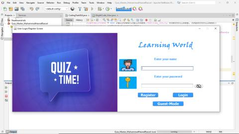
- 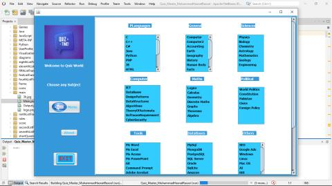
- 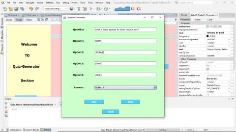
- 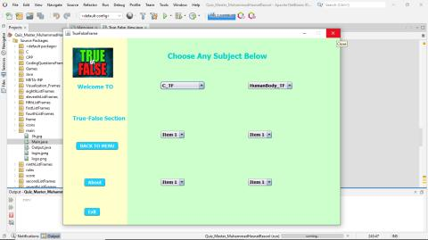
- 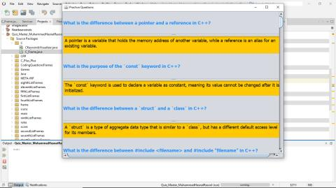
- 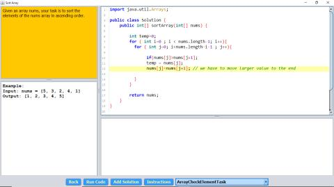
- 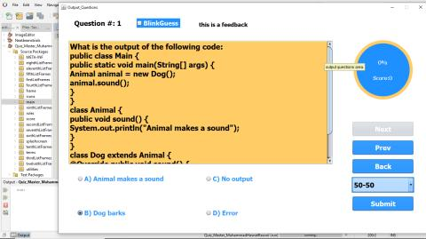
- 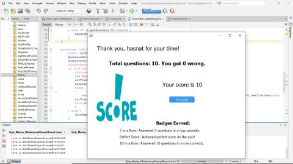
- 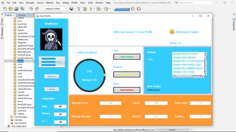
- 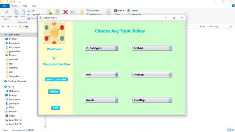
- 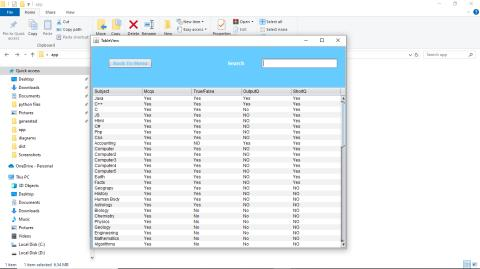
- 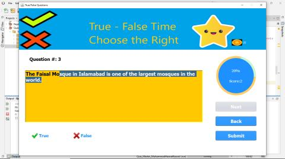
- 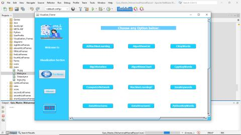

---

## 🔗 Technologies Used
- **Java Swing** - For the user interface.
- **Singleton & Design Patterns** - Ensuring scalable architecture.
- **Java Compiler API** - To compile and execute code inside the app.
- **Object-Oriented Programming (OOP)** - Robust and maintainable design.

---

## 💡 Future Enhancements
- 🚀 **More Question Categories**
- 🎨 **Enhanced UI & Theming Options**
- 🌍 **Multilingual Support**

---

## 🤝 Contributing
This project is **closed-source** and currently does not accept contributions.

---

## 📜 License
This application is for personal use only. **Source code is not provided**.

---

## 📩 Contact
For queries and support, feel free to reach out!

📧 **Email:** hasnatrasool163@gmail.com  
🌐 **Website:** https://hasnatrasool163.github.io/
